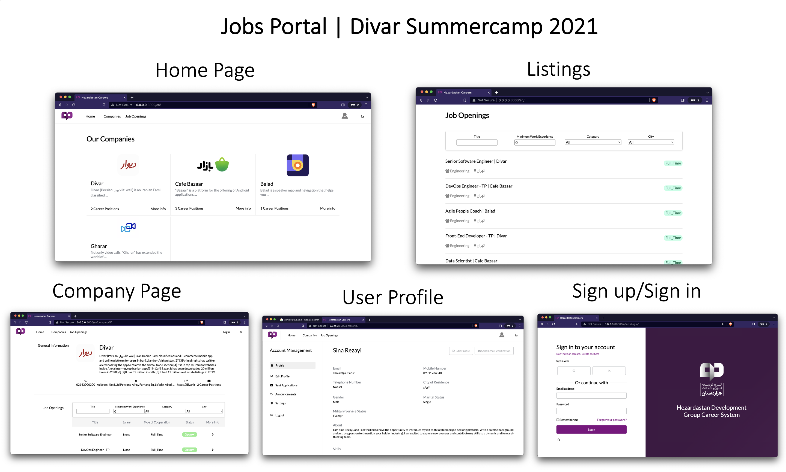

# Jobs Portal Application

This is a Django web application developed as an internship project for Divar SummerCamp 2021. 
The app allows companies to create profiles and post job openings, and job seekers to create profiles and apply for their desired opportunities.

The project has also been **dockerized**, offering compatibility with both `docker-compose` for local usage and deployment via `kubernetes` for more extensive environments. The project also includes predefined stages for an example CI/CD pipeline.

## Features

- Companies can showcase their career benefits, and post job openings.
- Job Seekers can create their profile mentioning their experience and background, and apply for openings.
- Job Seekers can get automatic periodic notifications via email about related job openings based on their skills and preferences.
- Job Seekers can generate a PDF version of their CV  based on their profile information.
- The app recommends jobs based on what one's interests and skills.

## Getting started

To start working with this project using the provided Makefile, you can follow the following stages.

- Installation: `make install`
- Running migrations: `make migrate` 
- [Optional] Loading the sample data by running `python manage.py loaddata sample.json`\*
- Launching the dev server: `make run_server`
- Running tests: `make test`

## Demo

For a visual overview, check out the figure below:

## Program Information
- **Program**: Summercamp Internship
- **Company**: Divar.ir  
- **Semester**: Summer 2021

Let me know if you have any questions!
